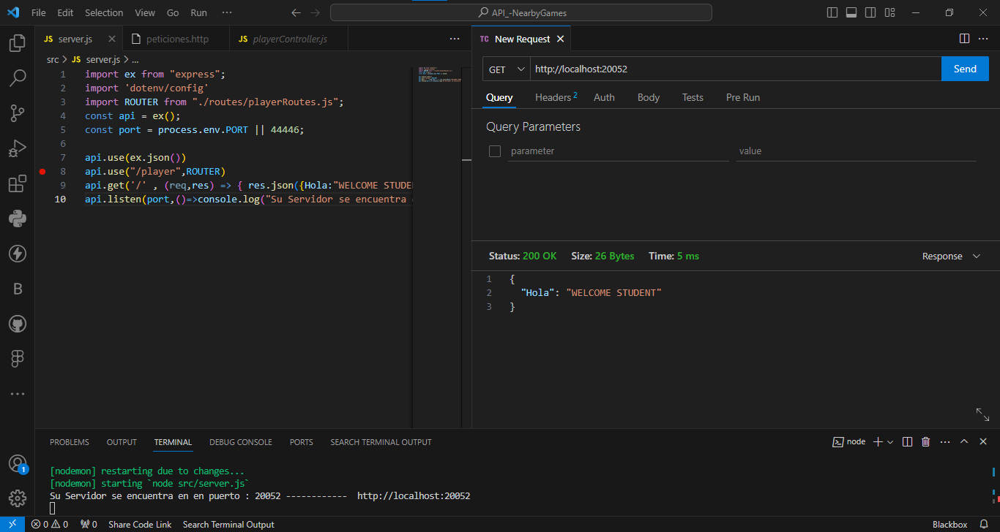
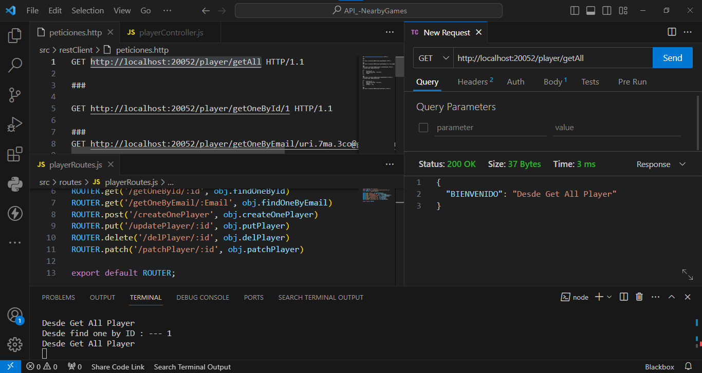
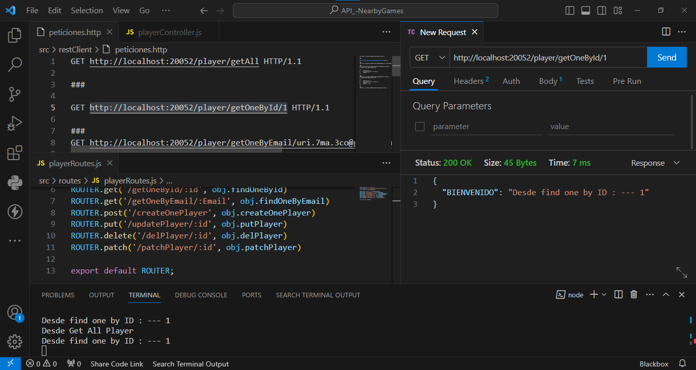
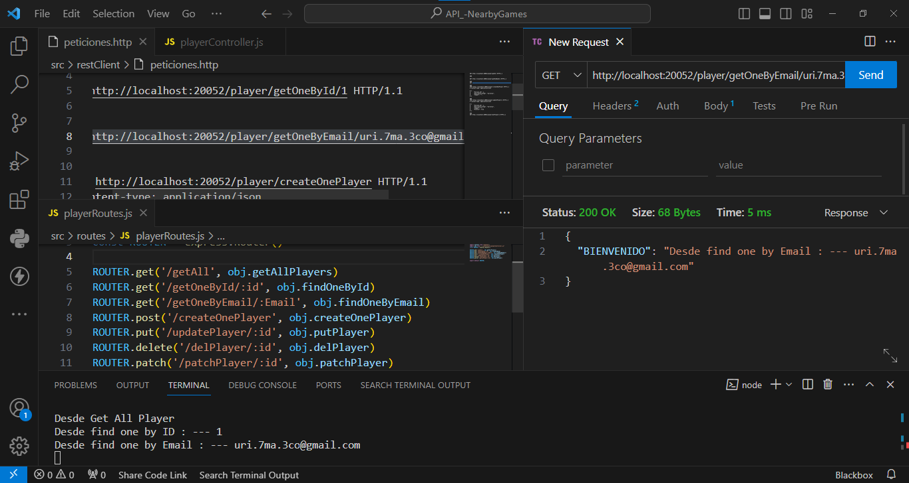
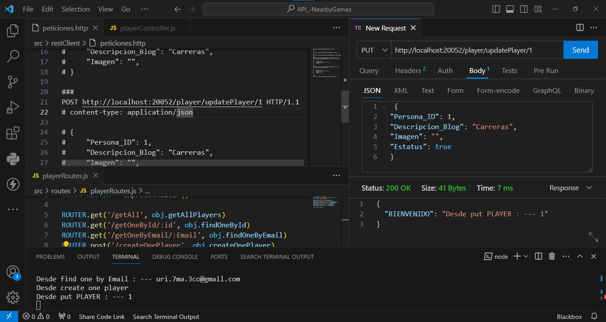
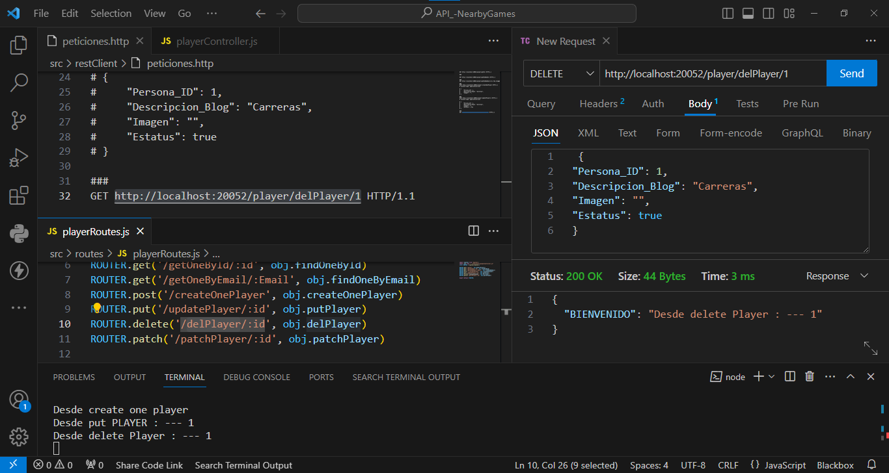

<div align="justify">

# API Nearby Games: API Rest para realizar operaciones CRUD en una base de datos relacional para el proyecto de videojuego de carreras 2D.


## Información General
- **Creado por:** Uriel Maldonado Cortez
- **Asignatura:** Desarrollo Movil Integral
- **Grado:** 10
- **Grupo:** A
- **Docente:** MTI. Marco Antonio Ramirez Hernandez

# Desarrollo Backend del Videojuego Api Rest"
El desarrollo de esta API comenzó instalando las dependencias esenciales para el proyecto mediante Node.js, utilizando las bibliotecas y herramientas como Express, Nodemon, Dotenv y Cors. Estas dependencias proporcionan un entorno robusto y eficiente para la creación de aplicaciones web en Node.js.

- **Api_Game:** Contiene el código fuente del backend, incluyendo la conexión a la base de datos, rutas, controladores y configuración de NodeJs.
- **Pruebas:** Incluye imágenes de pruebas de recorrido para las rutas de inserción, actualización, búsqueda y eliminación de datos.

## Estructura del Proyecto

- **node_modules:** Contiene los paquetes y funcionalidades necesarios para el desarrollo en Node.js. Esta carpeta es generada automáticamente por npm al instalar las dependencias definidas en `package.json`.

- **src:** Esta carpeta contiene los archivos y carpetas esenciales para el funcionamiento del backend de la aplicación.

  - **controllers:** En esta carpeta se encuentran los archivos que manejan las solicitudes del usuario y devuelven las respuestas apropiadas. Cada controlador se encarga de una funcionalidad específica de la aplicación.

  - **models:** Aquí se encuentran los archivos que definen los modelos de datos utilizados en la aplicación. Estos modelos representan la estructura de los datos en la base de datos.

  - **routes:** Contiene archivos que definen las rutas de la aplicación. Cada archivo de ruta se encarga de gestionar las solicitudes HTTP para una entidad específica.

  - **config:** En esta carpeta se encuentran archivos de configuración que pueden incluir la configuración del servidor, la configuración de la base de datos, entre otros.

  - **lib:** Esta carpeta almacena librerías adicionales que pueden ser utilizadas en el proyecto.

  - **RestClient:** Contiene archivos HTTP que representan solicitudes y respuestas simuladas para probar las rutas del backend.

  - **server.js:** Este archivo es el punto de entrada principal del servidor. Se encarga de importar las dependencias necesarias, configurar middlewares, definir las rutas de solicitud y poner en marcha el servidor.

- **.env:** Archivo de configuración que almacena variables de entorno sensibles, como información de la base de datos, claves secretas, etc. Este archivo es importante para mantener la seguridad de la aplicación y no debe compartirse públicamente.


## Capturas de Pantalla Actividad 1
<p align="center">
  
  
  
  
  
  
  
</p>

### Actividad 2: Integración de la Conexión de Base de Datos y Creación de Ruta para Obtener Todos los Datos de la Tabla

#### 2.1 Configuración de la Conexión a la Base de Datos

En la carpeta `config`, se creó el archivo `db.js` para gestionar la conexión con la base de datos. Este archivo se encarga de establecer la conexión con la base de datos MongoDB. La configuración incluye parámetros como el nombre de la base de datos y opciones específicas de conexión.
```javascript
// config/db.js
```
Configuración de la Conexión a la Base de Datos
En la carpeta config, se creó el archivo db.js para gestionar la conexión con la base de datos. Este archivo se encarga de establecer la conexión con la base de datos mysql. La configuración incluye parámetros como el nombre de la base de datos y opciones específicas de conexión.

Importación de Rutas y Configuración en server.js
Dentro del archivo principal server.js, se importaron las configuraciones de la conexión a la base de datos desde db.js y el modelo de la tabla tbb_players desde playerModel.js.

Implementación en playerController.js
En el archivo playerController.js, se integró el código necesario para obtener toda la información de la tabla tbb_players. 

#### Capturas de Pantalla Actividad 2
<p align="center">
</p>

### Actividad 3: Creación de una API Completa con Funcionalidad para la Tabla tbb_players

Búsqueda por ID
En la Actividad 3.1, se implementó la funcionalidad de búsqueda por ID, permitiendo recuperar información específica de la tabla tbb_players mediante un identificador único.

#### Búsqueda por Email
Se integró el código necesario para buscar registros en la tabla tbb_players utilizando el campo de correo electrónico. 

#### Creación de Datos
Permite la inserción de nuevos registros en la tabla tbb_players.

#### Actualización de Datos
Actualiz información existente en la tabla tbb_players. Esta funcionalidad permite realizar modificaciones en los datos de un jugador específico.

#### Eliminación Permanente por ID
Eliminación permanente de registros en la tabla tbb_players mediante el uso del ID del jugador. Esto proporciona la capacidad de eliminar de manera definitiva un jugador de la base de datos.

#### Actualización con PATCH por ID
Actualizar un elemento de la tabla tbb_players utilizando la operación PATCH. Esto permite realizar modificaciones parciales en los datos de un jugador específico, proporcionando flexibilidad en las actualizaciones.

### Capturas de Pantalla Actividad 2
<p align="center">
</p>

### Configuración del Proyecto
Asegúrate de tener [Node.js](https://nodejs.org/) instalado.
1. Clona el repositorio.
2. Instala las dependencias usando `npm install`.

### Configuración de la Base de Datos
Asegúrate de tener una base de datos MySQL configurada. Puedes modificar la configuración en el archivo `.env`.

### Ejecutar el Servidor
Ejecuta el siguiente comando para iniciar el servidor en modo de desarrollo:
```bash
npm run dev
```
</div>
